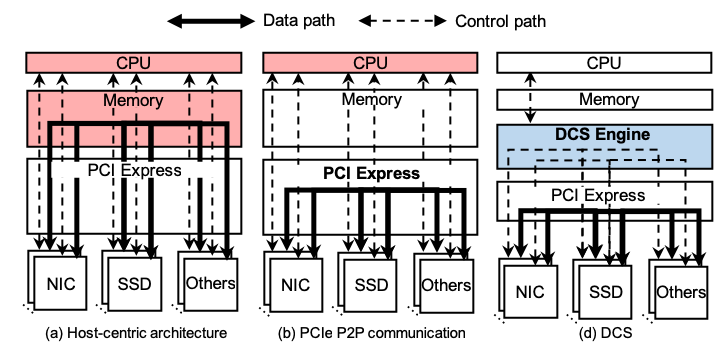
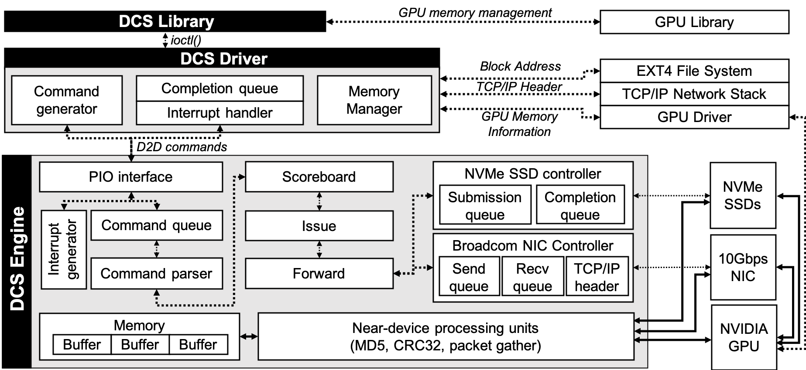

## DCS: A Fast and Scalable Device-Centric Server Architecture

DCS is a _device-centric_ server architecture to fully exploit the potential of the emerging peripheral devices so that the server performance nicely scales with the performance of the devices. Unlike typical _host-centric_ architectures, DCS provides fast data and control paths between peripheral devices incorporating _direct inter-device communications_ and _hardware-based device-control mechanisms_, without disturbing the host-side resources.

DCS provides the following features:

* __Fast__ device operations with direct inter-device communications and hardware-based device-control mechanisms
* __Scalable__ server performance scaling with the performance of and the number of peripheral devices
* __Flexible__ hardware-based device mechanism to support any types of off-the-shelf PCIe devices

## Device-Centric Server Architecture

  

Modern servers are now being equipped with an increasing number of high-performance peripheral devices such as domain-specific accelerators, non-volatile memory storage, and high-bandwidth network interface cards through fast interconnect technologies. Incorporating such high-performance devices and interconnect technologies, modern servers offer unprecedented performance and keep up with the ever-increasing performance demands of server workloads.

However, when a modern server deploys an increasing number of high-performance peripheral devices, the host CPU and memory can become extremely busy only to execute complex kernel routines frequently invoked by device operations. For such _host-centric_ server architectures, the overall server performance is throttled by the latency of device-handling software components and the bandwidth of CPU and memory available for the operations.

In this work, we carefully design and implement DCS, a _device-centric_ server architecture to overcome the inefficiencies of host-centric architecture and leverage the full performance of the emerging devices. The key idea of DCS is to allow multiple emerging devices to directly interact with each other in performing tasks, without host interventions. This optimization brings two significant benefits. First, devices achieve shorter latency and higher throughput from the efficient device management routines and the optimized data movement path. Second, the host becomes free from the device management routines and their corresponding resource consumption.

### DCS Engine

  

The key idea of DCS is to implement a fast and low-overhead device orchestrator, _DCS Engine_, for efficient and highly applicable D2D communications. It achieves high performance, scalability, and flexibility as follows. 

* First, DCS Engine manages all data and control paths among devices _at the hardware level_ while reducing the latency of inter-device communications and maximizing CPU and memory efficiency. 
* Second, DCS Engine utilizes _standard device controllers_ without having to integrate devices for device-to-device (D2D) communications and thus enables the flexible and scalable device deployment. 
* Third, by introducing _near-device processing_ (NDP) units for intermediate data processing at the kernel or application levels, DCS provides more opportunities for device-to-device communications in existing server applications.

### Software Support

We develop a Linux device driver to communicate with DCS Engine and provide optimized software stacks. 

* Interact with the existing kernel file system and TCP/IP network stacks to find necessary metadata such as block addresses and TCP/IP connection information to properly orchestrate D2D-involved devices
* Generate and forwards D2D commands and handle interrupts from DCS Engine
* Extend existing Linux generic NVMe and Broadcom NIC device drivers to dedicate device queue pairs in DCS Engine

### DCS Open Source Hardware

We are working on releasing a more user-friendly version with source code, both HDL and embedded software.

## Publications

**DCS: A Fast and Scalable Device-Centric Server Architecture** 
Jaehyung Ahn, Dongup Kwon, Youngsok Kim, Mohammadamin Ajdari, Jaewon Lee, and Jangwoo Kim 
_IEEE/ACM International Symposium on Microarchitecture_ (__MICRO__), Dec. 2015 
[[IEEE DL]](https://ieeexplore.ieee.org/document/7856627) [[ACM DL]](https://dl.acm.org/citation.cfm?id=2830794) [[Slide]](https://www.microarch.org/micro48/files/slides/E2-5.pdf)

**DCS-ctrl: A Fast and Flexible Device-Control Mechanism for Device-Centric Server Architecture** 
Dongup Kwon, Jaehyung Ahn, Dongju Chae, Mohammadamin Ajdari, Jaewon Lee, Suheon Bae, Youngsok Kim, and Jangwoo Kim 
_ACM/IEEE International Symposium on Computer Architecture_ (__ISCA__), Jun. 2018 
[[IEEE DL]](https://ieeexplore.ieee.org/document/8416850) [[ACM DL]](https://dl.acm.org/citation.cfm?id=3276588) [[Slide]](https://iscaconf.org/isca2018/slides/6B2.pdf) [[Lightning Talk]](https://youtu.be/oTZpcBWOLOw)

## People

* Dongup Kwon, Seoul National University
* Jaehyung Ahn, Pohang University of Science and Technology
* Youngsok Kim, Seoul National University
* Jaewon Lee, Seoul National University
* Dongju Chae, Pohang University of Science and Technology
* Mohammadamin Ajdari, Pohang University of Science and Technology
* Jangwoo Kim, Seoul National University

## Contact

* Dongup Kwon, Seoul National University, dongup@snu.ac.kr
